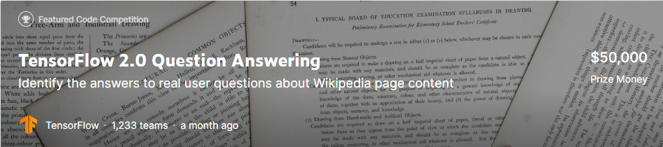

# Overview

*"Why is the sky blue ?"*

This is a question an open - domain QA system should be able to respond to . QA systems emulate how people look for information by reading the web to return answers to common questions.Machine Learning can be used to improve the accuracy of these answers.

Existing natural language models have been focused on extracting anwers from a short paragraph rather than reading an entire page of content for proper context.As a result,the responses can be complicated or lengthy.A good answer will be both succint and relevant.In this competition,our goal is ti predict short and long answer responses to real questions about Wikipedia articles.

This dataset is provided by [Google Natural's Question](https://ai.google.com/research/NaturalQuestions/dataset),but contains its own unique private test set. 

A [Visualization of examples](https://ai.google.com/research/NaturalQuestions/visualization) shows long and where available short  answers.

In addition to prizes for the top teams,there is a special set of awards for using Tensorflow 2.0 APIs.If successful,this challenge will help spur the development of more effective and robust QA systems

# Data
In this competition , Kaggle help us select the best short and long answers from Wikipedia articles to the given questions

## What should I expect the data format to be ?

Each sample contains a Wikipedia article , a related question,and the candidate long form answers.The training examples also provide the correct long and short form answer or answers for the example,if any exist.

## What am I predicting ?

For each article + question pair,I must predict/select long and short answer form answers to the question drawn directly from the article

- A long anwer would be a longer section of text that answers the question,serveral sentences or a paragraph
- A short answer might be a sentence or phrase,or even in some cases a YES/NO.The short answers are always contained within/a subset of 
one of the plausible long answers.
- A given article can (or very often) allow for both long and short answers,depending on the question

There is more detail about the data [on the Github page for the Natural Questions dataset](https://github.com/google-research-datasets/natural-questions/blob/master/README.md).

This page also contains helpful utilities and scripts.Note that I am using the simplified text version of the data - most of the HTML tags have been removed,and only those necessary to break up papragraphs sections are included

## File descriptions
- simplified-nq-train.jsonl : the training data,in newline-delimited JSON format
- simplified-nq-kaggle-test.jsonl : the test data,in newline-delimited JSON format
- sample_submission.csv : a sample submission file in the correct format

## Data fields
- **document_text**: the text of the article in question(with some HTML tags to provide document structure).The text can be tokenized 
by spliting on whitespace.
- **question_text**: the question to be answered
- **long_answer_candidates**: a JSON array containing all of the plausible long answers
- **annotations**: a JSON array containing all of the correct long+short answers.Only provided for train.
- **document_url**: the URL for the full articles.Provided for informational purposes only.This is NOT the simplified version of the 
article so indices from this cannot be used directly.The content may also no longer match the html used to generate **document_text**.
Only provided for train.
- **example_id**: unique ID for the sample.

# Evaluation
Submissions are evaluated using [micro F1](https://scikit-learn.org/stable/modules/generated/sklearn.metrics.f1_score.html) between the predicted and expected answers.

Predicted long and short answers must match exactly the token indices of one of the ground truth labels (or match YES/NO if the question has a yes/no short answer).There maybe up to five labels for long answers,and more for short.If no answer applies,leave the prediction blank/null.

The metric in this competition diverges from the 
[original metric](https://github.com/google-research-datasets/natural-questions/blob/master/nq_eval.py) in 2 key respects:
- short and long answer formats do not receive separate scores,but are instead combined into a 
[micro F1](https://scikit-learn.org/stable/modules/generated/sklearn.metrics.f1_score.html) score acorss both formats
- this competition metric does *not* use `confidence` scores to find an optimal threshold for predictions

Additional detail :

where :

and :
<pre>
TP = the predicted indices match one of the possible ground truth indices

FP = the predicted indices do NOT match one of the possible ground truth indices,OR a prediction has been made 
where no ground truth exists

FN = no prediction has been made where a ground truth exists
</pre>

In micro F1,both long and short answers count toward an overall precision and recall,which is then used to calculate a single F1 value

# Submission file
For each ID in the test set,I must predict
- a set of start:end token indices
- a YES/NO answer if applicable (short answers ONLY)
- a BLANK answer if no preditction can be made.

The file should contain a header and have the following format:
<pre>
-7853356005143141653_long,6:18
-7853356005143141653_short,YES
-545833482873225036_long,105:200
-545833482873225036_short,
-6998273848279890840_long,
-6998273848279890840_short,NO
</pre>
